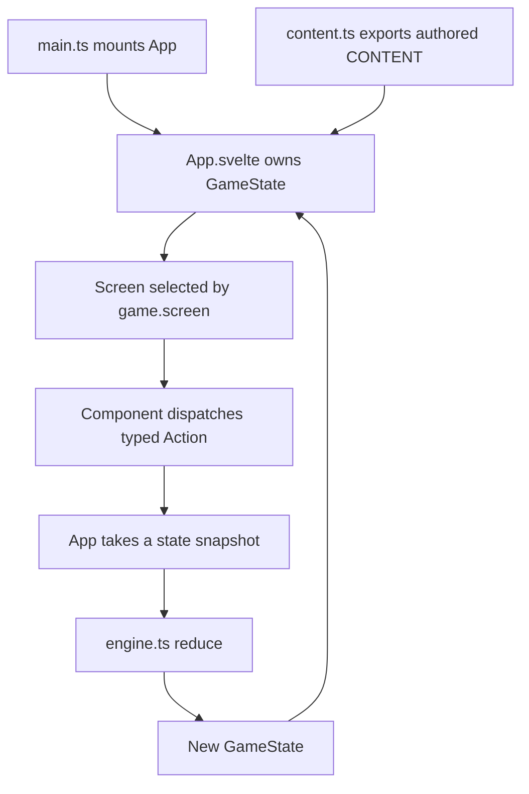
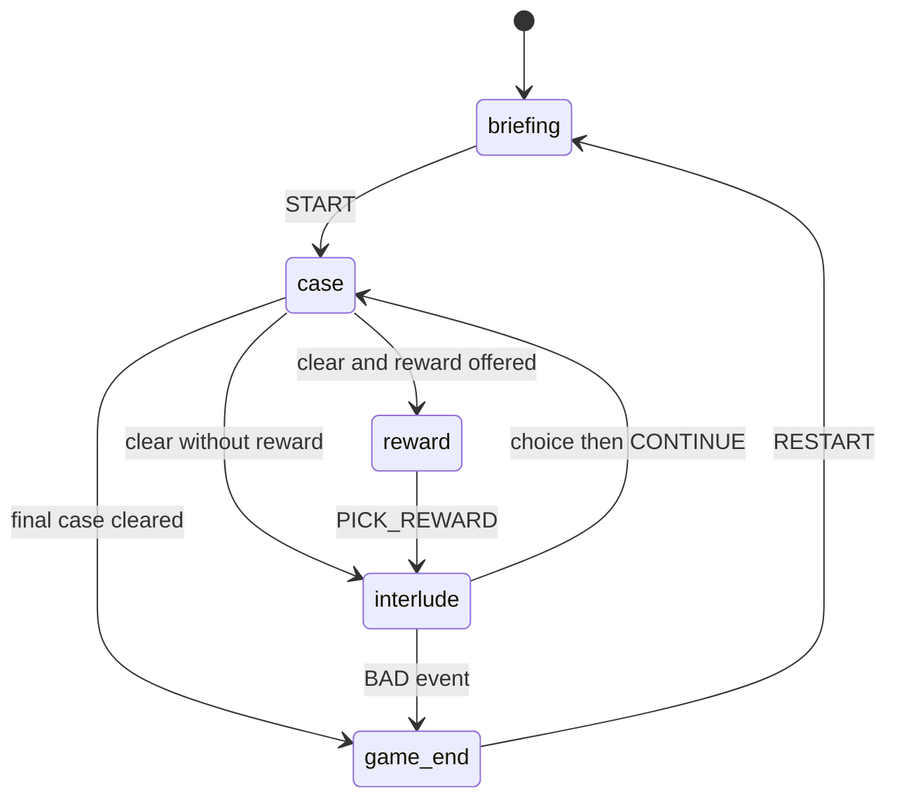
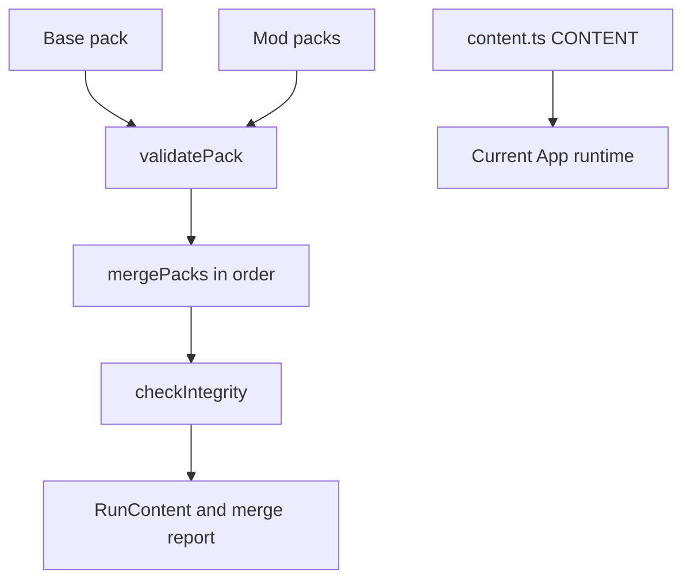

# Runtime architecture

## Shape of the application

The live application is a single Vite entrypoint. `/prototype/core-loop/src/main.ts` mounts `/prototype/core-loop/src/App.svelte`; `App.svelte` owns the entire reactive `GameState`, selects one of five screens, and dispatches typed actions to the UI-independent reducer in `/prototype/core-loop/src/lib/engine.ts`. There is no URL router, backend, persistence adapter, or runtime content fetch.

*The live runtime is a unidirectional in-memory loop over hard-coded content.*

This architecture [executes the card and context rules](../domain/game-model.md) in a single deterministic state transition boundary. Svelte 5 `$state` proxies cannot be passed directly to `structuredClone`, so `App.svelte` calls `$state.snapshot(game)` before the reducer clones and updates ordinary data.

## Component boundaries

| Layer | Main sources | Responsibility |
|---|---|---|
| Bootstrap/state owner | `src/main.ts`, `src/App.svelte` | Mount app, own state, snapshot and dispatch, choose screen |
| Pure game engine | `src/lib/engine.ts` | Types, actions, reducer, tracks, placement, submission, progression, rewards, interludes |
| Rule helpers | `src/lib/facets.ts`, `dramaturgy.ts`, `persona.ts`, `josa.ts` | Facet legality, reactions, persona lines, dynamic Korean particles |
| Authored content | `src/lib/content.ts` | 20 clues, four patterns, four cases, hints, tracks, interlude content |
| UI | `src/lib/ui/*.svelte`, `src/app.css` | Five screens, board, hand, meters, reactions, background, visual treatments |
| Standalone contracts | `src/lib/datapack.ts`, `schema/game-data-pack.json` | Validate and merge external pack-shaped data, not wired into app startup |
| Disconnected experiment | `src/lib/scenario.ts` | Adjacent-card narrative composition, not imported by the current runtime |

The [source map](../source-map.md) gives file-level starting points and warns about generated, historical, and isolated evidence.

## Screen lifecycle

`GameState.screen` drives a five-state lifecycle. A cleared case pauses for feedback before `ADVANCE`; a reward is optional; interludes may end the run through an authored BAD event; the final case advances directly to a GOOD ending.

*Screen transitions are reducer-owned even though the root component chooses what to render.*

The screen components are:

- `BriefingScreen.svelte`: collection/pattern/hint summary and run start.
- `CaseScreen.svelte`: deduction sentence, slots, hypothesis, hand/facets, hints, notebook, submission and reactions.
- `RewardScreen.svelte`: select one offered clue.
- `InterludeScreen.svelte`: spend action points and make a narrative choice.
- `EndScreen.svelte`: GOOD/BAD summary and restart.

This lifecycle is the runtime side of the [player workflow](../workflows/play-and-content.md).

## State and action boundary

`GameState` combines persistent run state, case-local state, and interlude state. Persistent fields include global `heat` and `trust`, owned and verified collections, known facets, notebook, history, case index, and ending. Case-local fields track placements, confirmations, declarations, submissions, hints and clear/advance state. Interlude state records its event, action points, investigations and choice.

The action union includes `START`, `PLACE`, `LOCK_SLOT`, `CLEAR_SLOT`, `SET_LOCK_MODE`, `DECLARE`, `SUBMIT`, `HINT`, `PICK_REWARD`, `INVESTIGATE`, `INTERLUDE_ACTION`, `INTERLUDE_CHOICE`, `ADVANCE`, `CONTINUE`, and `RESTART`.

The current UI effectively uses **immediate commitment**. Alternative `commit` and `submit` modes remain in the engine and smoke suite, but no current component exposes the lock-mode selector or explicit `LOCK_SLOT`. Treat them as compatibility/test assets, not visible product modes.

## Runtime content and data-pack boundary

`App.svelte` imports `CONTENT` directly from `content.ts`. By contrast, `datapack.ts` offers a three-stage API—shape validation, ordered base/mod merge with provenance, and post-merge referential integrity—but no live bootstrap invokes it.

*The lower pack path is implemented as a standalone contract; the authored-content path is what the app runs today.*

The intended generation and integration path is documented in [play and content workflows](../workflows/play-and-content.md), and its checks are covered by [testing guidance](../testing/guidance.md).

## UI architecture lessons from history

Ticket 24 and its follow-up commits turned the play screen into a vertical hierarchy: state-owned background, compact meters, dominant deduction sentence, reaction band, and a four-suit hand rail. Browser validation found defects that type/build/smoke checks could not detect:

- a generated background path was accidentally case-owned instead of state-owned;
- z-index changes masked a viewport/grid sizing error;
- a hand fan was positioned by guessed pixel constants and obscured its own controls;
- a conditional missing grid row left a “ghost” row and overflowed the viewport.

The durable rule is to anchor layout to actual structure or shared CSS variables (`bottom: 100%`, explicit grid rows, one topbar-height source), not to duplicate another element’s presumed dimensions. The [testing guide](../testing/guidance.md) turns this into browser acceptance checks.

## Known architecture seams

- `scenario.ts` is a pure adjacent-card coherence experiment, but the deleted `ScenarioBoard` is not part of the current screen flow.
- `lastLock` and exported `influenceOf` carry useful data but are not consumed by current UI code.
- Reducer `PLACE` trusts callers; facet usability is enforced by the UI and authored-content validators rather than rechecked at the reducer boundary.
- The source still contains prototype-era comments and stale UI copy. Prefer current wiring and governing ticket resolutions when descriptions conflict.
- Production promotion, persistence, external packs, and generation remain outside current mainline runtime. Operational and worktree status is in the [runbook](../operations/runbook.md).
