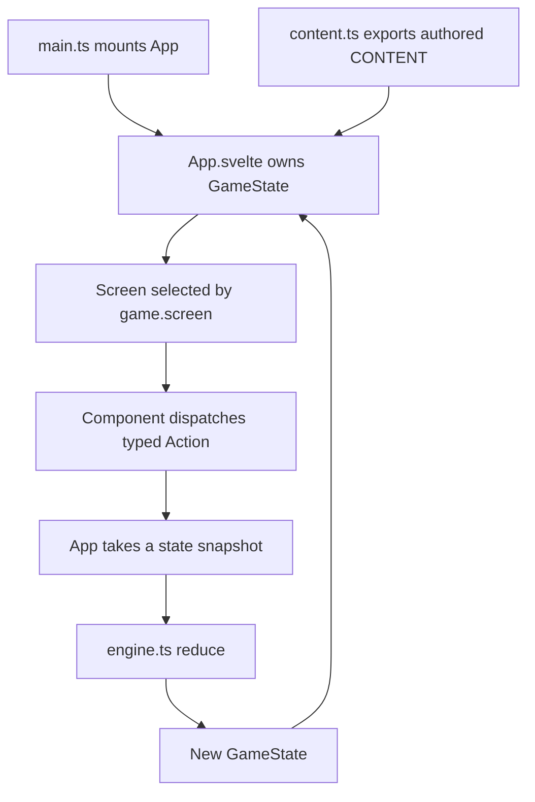
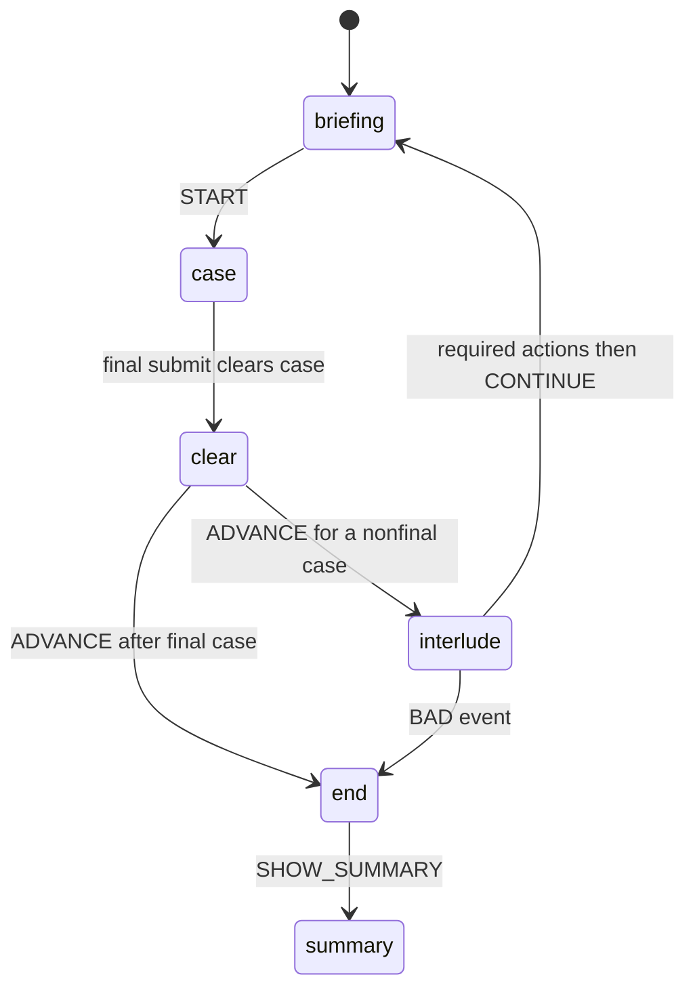
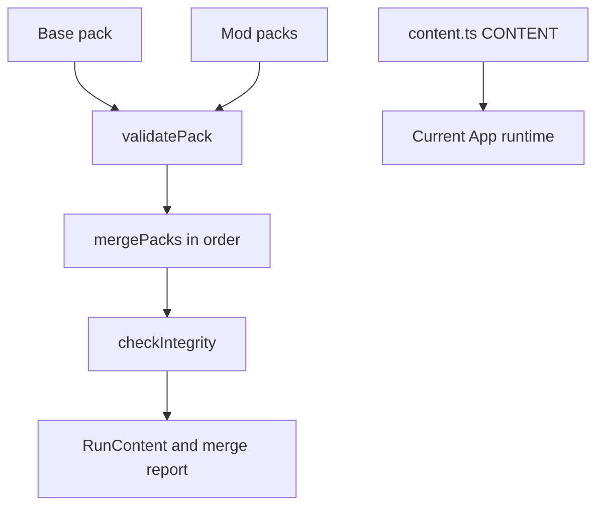

# Runtime architecture

## Shape of the application

The live application is a single Vite entrypoint. `/prototype/core-loop/src/main.ts` mounts `/prototype/core-loop/src/App.svelte`; `App.svelte` owns reactive `GameState`, selects app views and reducer-owned run screens, and dispatches typed actions to the UI-independent reducer in `/prototype/core-loop/src/lib/engine.ts`. There is no URL router, backend, or runtime content fetch. Browser-local persistence is live: versioned run snapshots and collection progress use `localStorage`; imported pack bodies use IndexedDB only in the developer-facing pack view.

*The live runtime is a unidirectional `CONTENT`-backed loop; accepted actions also persist run and collection progress in the browser.*

This architecture [executes the card and context rules](../domain/game-model.md) in a single deterministic state transition boundary. Svelte 5 `$state` proxies cannot be passed directly to `structuredClone`, so `App.svelte` calls `$state.snapshot(game)` before the reducer clones and updates ordinary data.

## Component boundaries

| Layer | Main sources | Responsibility |
|---|---|---|
| Bootstrap/state owner | `src/main.ts`, `src/App.svelte` | Mount app, own state, snapshot and dispatch, select Home/Collection/run views, persist accepted progress |
| Pure game engine | `src/lib/engine.ts` | Types, actions, reducer, tracks, placement, review/final submission, progression and interludes |
| Rule and state helpers | `src/lib/facets.ts`, `dramaturgy.ts`, `persona.ts`, `josa.ts`, `collection.ts`, `run-session.ts` | Facet legality, reactions, Korean particles, durable collection and versioned run snapshots |
| Authored content | `src/lib/content.ts`, `narrative-content.ts` | 20 clues, four patterns, four cases, hints, tracks, interludes and endings |
| UI and audio | `src/lib/ui/*.svelte`, `src/app.css`, `audio.ts` | Home, collection, run screens, notebook, selected-card detail drawer, visual treatments, settings and browser audio with silent fallback |
| Pack tooling | `src/lib/datapack.ts`, `pack-storage.ts`, `schema/game-data-pack-v2.json` | Validate/merge v2 packs and store them for the developer-only pack screen; not normal game startup |
| Disconnected experiment | `src/lib/scenario.ts` | Adjacent-card narrative composition, not imported by the current runtime |

The [source map](../source-map.md) gives file-level starting points and warns about generated, historical, and isolated evidence.

## Screen lifecycle

`GameState.screen` drives six reducer-owned run states. App-level Home and Collection sit outside that state machine. A final submission that clears a case enters dedicated feedback before `ADVANCE`; guest grants are automatic, and interludes may end the run through an authored BAD event.

*Screen transitions are reducer-owned even though the root component chooses what to render.*

The screen components are:

- `HomeScreen.svelte` and `CollectionScreen.svelte`: start/resume a run and inspect durable collection progress.
- `BriefingScreen.svelte`: collection/pattern/hint summary and run start.
- `CaseScreen.svelte`: deduction sentence, slots, hypothesis, hand/facets, hints, notebook, review and final submission.
- `ClearFeedbackScreen.svelte`: display clear feedback before progression.
- `InterludeScreen.svelte`: use authored actions within the interlude AP budget.
- `EndScreen.svelte` and `RunSummaryScreen.svelte`: display GOOD/BAD outcome, then summary, collection, or Home.

During case composition, `HandRail.svelte` keeps the selected card's thumbnail in the pickup readout; its control opens `CardDetailDrawer.svelte`. The drawer reuses the durable collection's facet slots and card-specific rejected interpretations, including a non-owning guest-card view, but does not dispatch reducer actions or alter selection rules. This UI relationship surfaces the [game model](../domain/game-model.md) during play without changing the player workflow.

`ReactionBand.svelte` also renders the single neutral Raiden portrait supplied by `persona.ts`. The helper builds its URL from Vite’s public base through `publicAssetUrl`, so the required `public/assets/characters/raiden-neutral.webp` works on the GitHub Pages repository subpath as well as local hosting. The [testing guidance](../testing/guidance.md) covers the corresponding public-asset and release-closure checks; this is one neutral presentation asset, not evidence of state-specific portrait variants.

This lifecycle is the runtime side of the [player workflow](../workflows/play-and-content.md).

## State and action boundary

`GameState` combines persistent run state, case-local state, and interlude state. Persistent fields include global `heat` and `trust`, owned and verified collections, known facets, notebook, history, case index, and ending. Case-local fields track placements, confirmations, declarations, submissions, hints and clear/advance state. Interlude state records its event, action points, investigations and choice.

The action union includes `START`, `PLACE`, `LOCK_SLOT`, `CLEAR_SLOT`, `SET_LOCK_MODE`, `DECLARE`, `REQUEST_REVIEW`, `RETURN_TO_COMPOSE`, `FINAL_SUBMIT`, `HINT`, `INTERLUDE_ACTION`, `ADVANCE`, `CONTINUE`, and `SHOW_SUMMARY`.

The current UI effectively uses **immediate commitment**. Alternative `commit` and `submit` modes remain in the engine and smoke suite, but no current component exposes the lock-mode selector or explicit `LOCK_SLOT`. Treat them as compatibility/test assets, not visible product modes.

## Runtime content and data-pack boundary

`App.svelte` imports `CONTENT` directly from `content.ts` for ordinary gameplay. `?data-packs=1` instead renders `DataPackScreen`, which validates and merges ordered v2 packs and persists selected pack bodies through `pack-storage.ts`. Before IndexedDB writes, that seam JSON-serializes and reparses the pack body so a Svelte reactive proxy cannot reach IndexedDB's structured-clone boundary. That developer-only output is not passed to normal `initGame` or reducer calls.

*The pack path is live developer tooling with local storage; the normal game still runs authored `CONTENT`.*

The intended generation and integration path is documented in [play and content workflows](../workflows/play-and-content.md), and its checks are covered by [testing guidance](../testing/guidance.md).

## UI architecture lessons from history

Ticket 24 and its follow-up commits turned the play screen into a vertical hierarchy: state-owned background, compact meters, dominant deduction sentence, reaction band, and a four-suit hand rail. Browser validation found defects that type/build/smoke checks could not detect:

- a generated background path was accidentally case-owned instead of state-owned;
- z-index changes masked a viewport/grid sizing error;
- a hand fan was positioned by guessed pixel constants and obscured its own controls;
- a conditional missing grid row left a “ghost” row and overflowed the viewport.

The durable rule is to anchor layout to actual structure or shared CSS variables (`bottom: 100%`, explicit grid rows, one topbar-height source), not to duplicate another element’s presumed dimensions. The [testing guide](../testing/guidance.md) turns this into browser acceptance checks.

## Known architecture seams

- `scenario.ts` is a pure adjacent-card coherence experiment, but the deleted `ScenarioBoard` is not part of the current screen flow.
- `lastLock` and exported `influenceOf` carry useful data but are not consumed by current UI code.
- Reducer `PLACE` trusts callers; facet usability is enforced by the UI and authored-content validators rather than rechecked at the reducer boundary.
- The source still contains prototype-era comments and stale UI copy. Prefer current wiring and governing ticket resolutions when descriptions conflict.
- Normal gameplay still does not consume merged external-pack output. Persistence, v2 pack tooling, and generated-content contracts are mainline. GitHub Pages delivery is covered by a committed manual release workflow; browser/component automation remains a separate gap. Operational status is in the [runbook](../operations/runbook.md).
