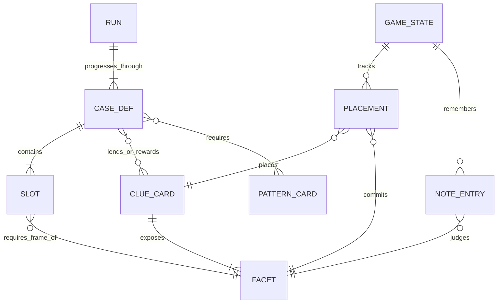
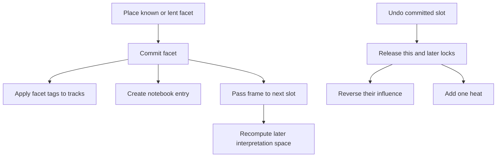

# Game model and vocabulary

Use `/CONTEXT.md` as terminology authority and closed ticket resolutions as decision authority. This page synthesizes those concepts with the implemented rules in `engine.ts`, `facets.ts`, and `content.ts`.

## Product boundary

A **case** is one build-time-authored/generated incident puzzle reconstructed with clue cards. A **run** is a sequence of cases ending in a composite-pattern boss. The MVP fixes one run at four cases—three regular cases and one boss—with 20 clue cards and four pattern cards. Raiden is the only borrowed Dead Letters character; the world and plot are otherwise independent.

The current authored cases are a locked greenhouse, dock warehouse alibi, missing banker, and an “invisible deliveryman” boss combining two patterns. See the [player and content workflow](../workflows/play-and-content.md) for progression and generation boundaries.

## Core entities

*Cases define slots and vocabulary access; runtime state records which card-facet interpretations were committed and judged.*

A **clue card** is collectible deduction vocabulary. It has a suit, existence kind, display tags, and multiple facets. A **facet** is a `(frame, meaning)` interpretation with its own tags, note text, optional state gate, and optional required previous frame. The nine implemented frames are route, means, trace, action, motive, record, omission, scene, and identity.

A **pattern card** is vocabulary for hypothesis declaration. A **guest clue/facet** is lent for one case and becomes permanently owned/known after clear. A **hint card** is consumable rather than part of the permanent collection.

## Four independent facet axes

Do not collapse these into one “locked/unlocked” state:

| Axis | Question | Implemented representation |
|---|---|---|
| Commitment | Has the player decided to use this facet here? | `Placement.locked` |
| Knowledge | Does the player know this interpretation? | `knownFacets` plus case-lent facets |
| Availability | Is it usable in current state and previous context? | `facetStatus` gate/previous-frame verdict |
| Judgment history | Has a submission produced a result for this reading? | notebook entry with non-null correctness |

A facet may be known but unjudged, judged but currently blocked, or available but wrong for a slot. This distinction supports **노트 대조**: the hand highlights slots only when a reading is usable, role-fitting, and previously judged. It removes repetitive clicks without revealing whether the card is the answer.

## Placement, propagation, and undo

The adopted rule is **placement equals commitment**. Choosing a facet immediately:

1. locks that card-facet pair into a slot;
2. applies the facet’s tags to context tracks;
3. records knowledge and a notebook entry;
4. propagates its frame forward, opening or closing later interpretations;
5. may discover another facet through a strong adjacent link.

*Commitment is both an answer attempt and a state-changing move; undo is deliberately costly and cascading.*

`facetStatus` blocks interpretations in priority order: unknown, state gate, then missing/mismatched previous frame. Role fit is reported separately. The [architecture](../architecture/overview.md) explains where this pure rule is called, and [testing guidance](../testing/guidance.md) covers propagation and solvability checks.

## Context state and tags

The persistent context state has two fixed 0–10 axes:

- **heat / attention:** covert pulls down, public pushes up;
- **trust:** coercive pulls down, prudent pushes up.

Every case can add one authored variable axis driven by a selected tag. Logical facets do not directly move the two fixed tracks in the current tuning. Track changes happen when a facet is committed, regardless of whether it later proves correct. Undo adds heat. Hints are intended to consume hint resources without contaminating tracks.

BAD endings are selected by ordered interlude events, notably excessive attention and collapsed trust. Quiet/prudent extremes are not symmetric deaths; they can block interpretations and shrink the legal vocabulary instead. `RunContent.badHeat` helps presentation, but reducer routing follows authored interlude event conditions.

## Deduction and judgment

A case interleaves sentence pieces and slots. Each slot expects both a card and a facet frame; therefore the right card read through the wrong facet is a distinct **misreading**.

Submission:

1. judges any eligible pattern declaration;
2. commits remaining provisional placements;
3. resolves conditional answers against state;
4. checks card and required facet frame;
5. writes correct or struck-through notebook judgments;
6. emits authored or generated reactions;
7. confirms correct placements only when the threshold is met.

The partial-confirmation threshold is three correct open slots. Fewer than three confirms nothing unless the whole case is solved. A correct hypothesis verifies pattern cards and unlocks suit-by-suit proximity detail; otherwise feedback gives only an aggregate correct count.

Wrong-answer reactions prefer case-authored misfits, then authored hits, then deterministic kind-by-frame dramaturgy, then a suit fallback. Raiden voices particularly absurd mismatches. There is no current flat “wrong submission” heat penalty: the cost was already paid by committing facets.

## Knowledge and collection progression

Ownership is not full understanding:

- acquiring a card grants only its first facet;
- cases may lend guest cards and specific guest facets;
- commitment makes a facet known;
- strong links may reveal another facet;
- clearing a case permanently grants guests;
- cards used in correct confirmed answers become verified.

Collection progress therefore has at least two dimensions: owned and verified, with per-facet knowledge and judgment history beneath them. The MVP retains this collection identity but rejects a larger unvalidated currency/shop economy.

## Content-generation validity

The accepted build-time generation contract requires three machine-checkable properties:

1. **Solvable:** known and lent vocabulary can solve the case without softlock.
2. **Narratively coherent:** correct slot order is a full causal story.
3. **Failure-direction reachable:** starter vocabulary can reach each lethal direction.

Korean sentence correctness is another hard contract: content emits a `josaAfter` marker, and the renderer chooses the particle from the actually placed card name. Literal post-slot particles would leak the answer’s final-consonant shape. These rules connect the domain model to the [content workflow](../workflows/play-and-content.md) and its [verification gates](../testing/guidance.md).
