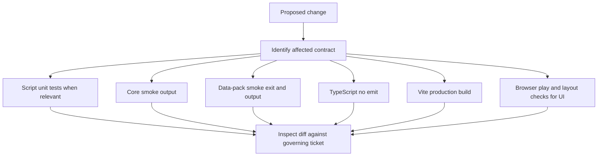

# Testing and verification guidance

## Verification layers

No single check proves this repository correct. The pure engine has executable smoke programs, the pack seam has stricter contract tests, scripts use Node tests, and the Svelte UI requires browser review.



*Acceptance is the intersection of machine gates, browser evidence when relevant, and decision/source review.*

## Baseline commands

From `prototype/core-loop`:

```bash
npm run smoke
npm run smoke:datapack
npx tsc --noEmit
npm run build
```

### Core smoke suite

`/prototype/core-loop/smoke.ts` exercises:

- complete campaign progression in all three engine lock modes;
- solvability from known/lent vocabulary at each progression point;
- authored answer coherence;
- reachability of both BAD directions;
- previous-frame propagation and cascade undo;
- Korean particle-leak and Hangul-ending authoring rules;
- conditional-answer stability cases.

**Important limitation:** logical checks primarily print `PASS`/`FAIL`; the script does not consistently count logical failures and force a nonzero process exit. Treat success as “command completed and output contains no `FAIL`,” not merely exit code 0.

### Data-pack smoke suite

`/prototype/core-loop/smoke-datapack.ts` covers:

- envelope/version rejection;
- clue, facet, case and particle shape rules;
- wrapping and round-tripping hard-coded content;
- base-only identity;
- ordered mod additions/overrides and provenance;
- broken-reference detection;
- synchronization between TypeScript enums and JSON Schema.

This suite does maintain a failure count and exits nonzero on failure. It verifies the standalone pack seam described in [play and content workflows](../workflows/play-and-content.md), not that the live app loads packs.

## Script tests

The root scripts have Node test files:

```bash
node --test scripts/cardart-batch.test.mjs
node --test scripts/cardart-compare.test.mjs
node --test scripts/check-cardart-manifest.test.mjs
node --test scripts/extract-higgsfield-url.test.mjs
node scripts/check-cardart-manifest.mjs
```

Run the focused test whenever changing its paired script. The manifest checker also compares IDs against `prototype/core-loop/src/lib/content.ts`, so it is the essential contract before art generation.

The Python extraction skeleton has no dedicated test suite on main. Its default inventory mode and draft validation can be exercised against an explicitly supplied OUT root, but draft success does not prove real facet extraction or case generation because those stages are stubs.

## Change-specific matrix

| Change area | Minimum checks | Additional evidence |
|---|---|---|
| `engine.ts`, `facets.ts`, `content.ts` | Both smoke suites, `tsc`, build | Compare behavior to governing tickets and [game model](../domain/game-model.md) |
| `datapack.ts` or Schema | Data-pack smoke, core smoke, `tsc`, build | Confirm enum synchronization and post-merge references |
| Svelte components or `app.css` | Both smoke suites, `tsc`, build | Browser play at representative viewport; inspect overlap, controls, state feedback and Korean spacing |
| `josa.ts` or sentence content | Both smoke suites and build | Render correct, wrong and empty-slot names with/without final consonants |
| Art scripts/manifest | Paired Node tests and manifest check | Prefer batch `--dry-run`; confirm style-key preflight and output boundary |
| Extraction script | Inventory and optional draft validation | Confirm STUB status is not misrepresented; avoid accidental base-ID override |
| Governance/ticket change | N/A as code gate | Verify authority, status, blockers, vocabulary ripple, map entry and dirty-file ownership |

The [operations runbook](../operations/runbook.md) provides command and worktree safety; the [source map](../source-map.md) identifies governing evidence.

## Browser acceptance for UI work

Repository history demonstrates that successful smoke/type/build checks can coexist with incorrect UI semantics. At minimum:

1. Run through briefing, case placement, facet picker, submission feedback, reward/interlude and ending paths affected by the change.
2. Verify unknown/gated/previous-context facet reasons are visible and accurate.
3. Verify placed card names receive dynamic particles; empty slots use neutral slash forms.
4. Verify background state and meters update on placement rather than only on submission.
5. Check the four suit tabs and expanded hand remain clickable and do not cover reaction/state layers.
6. Check normal and “awaiting advance” states for viewport overflow and ghost grid rows.
7. Inspect at the project’s desktop target and a narrower responsive viewport if CSS changed.
8. If HMR looks inconsistent, full-refresh and repeat before recording a defect.

Ticket 24’s recurring failure pattern is a standing regression rule: do not position an element using a guessed constant derived from another element’s size. Use actual grid placement, percentage anchoring, or shared CSS variables.

## Review against decisions

Machine checks do not validate product ownership or semantic intent. A prior delegated UI change passed all machine gates while making background assets case-specific, contradicting the governing state-owned-background decision. Therefore review must compare the diff with:

- the full closed ticket resolution and relevant comments;
- `/CONTEXT.md` terminology;
- current source wiring;
- dirty-worktree ownership;
- any explicit writable/read-only delegation scope.

This review relationship is why [architecture](../architecture/overview.md), [domain rules](../domain/game-model.md), and tests are separate concepts.

## Known test gaps

- No browser/component automation or end-to-end test framework is present on main.
- No persistent storage or pack-loading startup exists to test in the live app.
- `scenario.ts` is disconnected, so runtime smoke does not prove a user-visible scenario flow.
- The core smoke suite’s exit behavior can mask printed failures.
- Reducer callers can bypass UI facet-legality screening; current confidence comes from UI behavior and authored solvability checks.
- Interlude v1 pack schema is intentionally loose.
- Deployment automation, isolated generator E2E, v2 pack/storage and audio require their own reviewed integration gates before being documented as mainline-tested.
