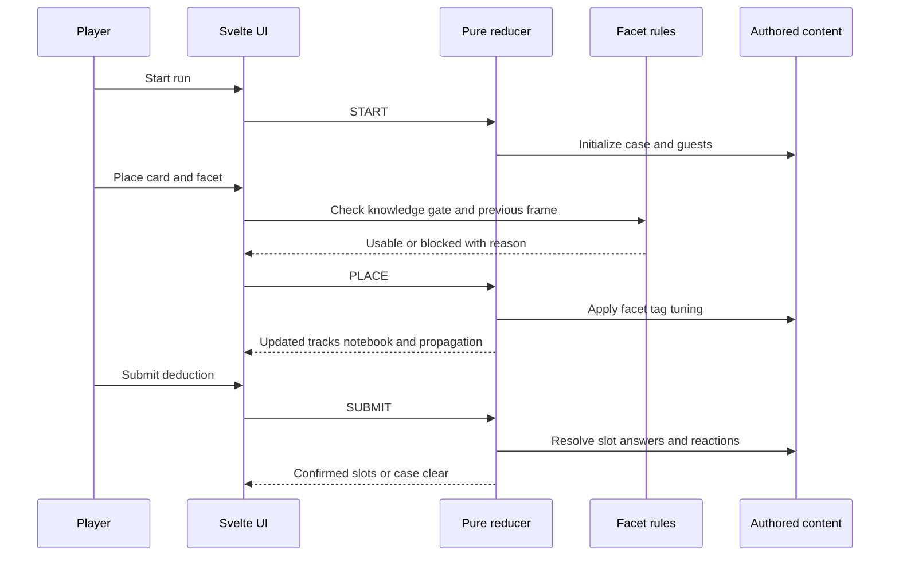
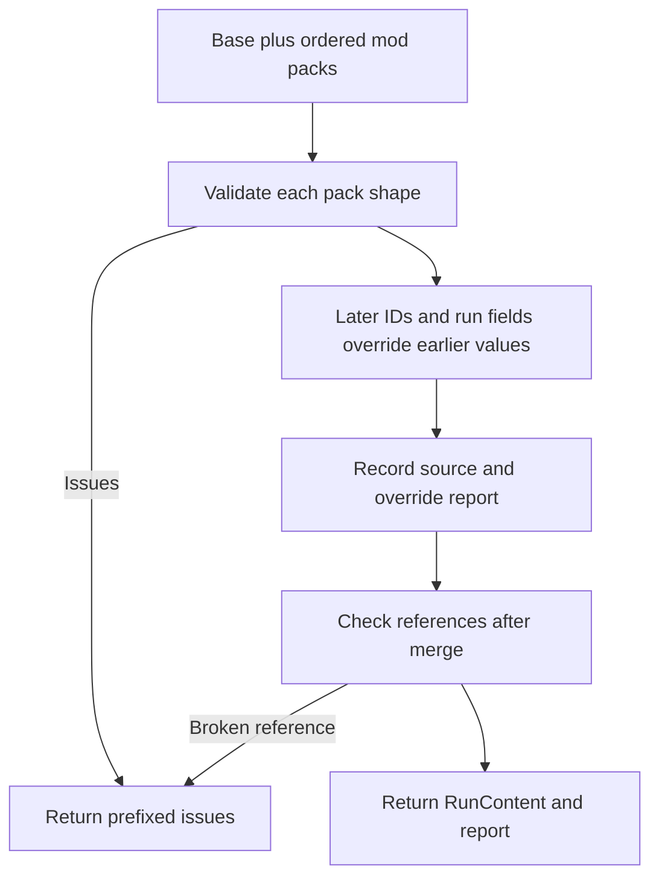
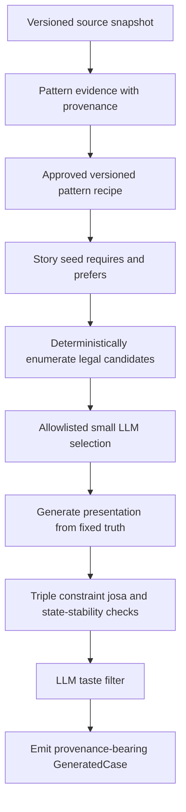

# Play and content workflows

## Player run flow

The reducer in `/prototype/core-loop/src/lib/engine.ts` owns progression; UI screens only dispatch actions and render the resulting state.

*The UI screens facet legality before dispatch, while the reducer owns state changes and judgment.*

A normal run proceeds as follows:

1. **Briefing:** inspect collection, patterns and hints, then `START`.
2. **Case:** optionally declare a pattern, place known/lent facets, use hints, and submit a complete set of open slots.
3. **Judgment:** exact card plus exact frame is correct; at least three correct open slots are partially confirmed; a complete solution clears the case.
4. **Reward:** if the authored pack pool offers unowned cards, choose one and learn its first facet.
5. **Interlude:** the first matching authored event is selected. Spend three AP on investigation or common actions, then choose a narrative option. A BAD event ends immediately.
6. **Next case or ending:** `CONTINUE` starts the next case. Clearing the boss yields the GOOD ending.

This flow exercises the [game model](../domain/game-model.md) and is rendered by the state machine in the [architecture overview](../architecture/overview.md).

## Authored runtime content

The live application uses `/prototype/core-loop/src/lib/content.ts`, not an emitted JSON pack. It contains:

- 20 clues split across four suits;
- four pattern cards;
- four cases including a dual-pattern boss;
- two hint definitions;
- tag deltas, initial state and starter collection;
- case axes, guest vocabulary and reward pools;
- ordered interlude events and common AP actions.

When editing this file, preserve these relationships: every slot answer must name a card with the required facet frame; every guest/reward/starter reference must exist; sentence pieces must number `slots + 1`; and post-slot Korean particles belong in `josaAfter`, not literal text.

## Implemented data-pack workflow

`/prototype/core-loop/src/lib/datapack.ts` and `/prototype/core-loop/schema/game-data-pack.json` define `game-data-pack@1`. Base and mod packs use the same envelope. The TypeScript loader is stricter than JSON Schema because it checks cross-field invariants and references.

*Cross-pack references are checked after merge because a mod may legitimately refer to base IDs.*

Important v1 contracts include:

- envelope format/version and namespace-like pack ID;
- record key equals item ID;
- facet key equals `<cardId>:<frame>` and frames are unique per card;
- clue names end in a precomposed Hangul syllable;
- case slot IDs are unique and `pieces.length === slots.length + 1`;
- `josaAfter` is required where literal particles would leak an answer;
- merged pattern, card, facet, hint, starter and answer references all exist;
- all five tag deltas are available after merge.

Interlude event/action shape remains intentionally loose in v1. Most importantly, `App.svelte` does not call `loadPacks`; this is a standalone validated seam rather than live external loading.

## Extraction skeleton

`/scripts/extract_game_data_pack.py` is a build-time skeleton that consumes the separate OUT repository’s catalog, clue libraries, case-pattern pages and texts. Its stages are source loading, candidate selection, facet extraction, case assembly, validation and emission.

Only inventory/candidate selection and draft-pack validation are mainline-real. **Facet extraction and case assembly are explicit STUBs.** `--emit-draft` creates placeholder facets and no playable cases. Its default `wiki.` card-ID prefix avoids accidentally overriding same-named base cards; an empty prefix means intentional promotion and should not be used casually.

The [operations runbook](../operations/runbook.md) includes the safe invocation and external-root caveat.

## Accepted future generation contract

Ticket 18 defines how build-time case generation should work even though its logic prototype remains isolated from main:

*LLMs select, phrase and evaluate; they do not author or mutate truth.*

The design separates `truth`, `presentation`, and optional `obstacles`. Truth owns explicit slot solutions and reusable mechanical axis profiles; presentation owns case-specific prose and axis labels. Conditional solutions must be fixed at placement/commit time so later state changes cannot invalidate an already accepted answer.

This contract depends on the [domain constraints](../domain/game-model.md) and is intended to reuse the [testing/validation layers](../testing/guidance.md). It is not evidence that main currently generates cases.

## Integration and status boundaries

- **Live:** hard-coded `CONTENT`, reducer, facet rules, UI screens, v1 pack validator/merger, JSON Schema and smoke suites.
- **Implemented but disconnected:** data-pack loading from app startup, alternative lock modes, `scenario.ts`.
- **Skeleton:** OUT extraction with placeholder draft emission.
- **Accepted design but isolated:** deterministic generator logic and provenance contract from ticket 18.
- **Open/unintegrated:** generator E2E, v2 packs, external loading/storage, expanded narrative/interlude contracts and audio.
- **Rejected as core dependency:** OpenWiki runtime/automatic canonical promotion. Its pilot contributed provenance/validator ideas but remains isolated.

Future agents should verify current tickets and worktree state through the [source map](../source-map.md) before treating a plan or isolated result as available functionality.
